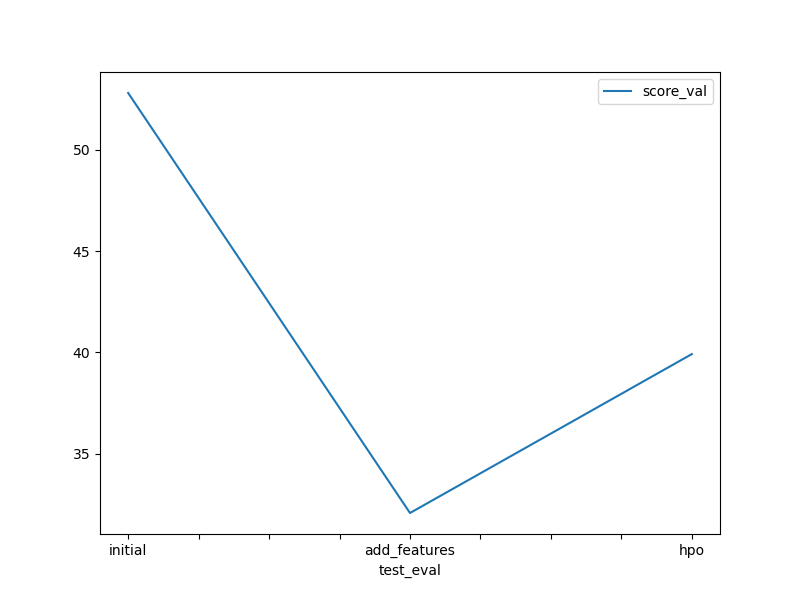

# Report: Predict Bike Sharing Demand with AutoGluon Solution
Name : Kishore Buridi

## Initial Training
### What did you realize when you tried to submit your predictions? What changes were needed to the output of the predictor to submit your results?
Answer: First submission was successful. as all the predictions are positive numbers, no further changes are required to submit the output. 

### What was the top ranked model that performed?
Answer: After the first training, WeightedEnsemble_L3 is the top ranked model with score_val -52.85

## Exploratory data analysis and feature creation
### What did the exploratory analysis find and how did you add additional features?
Answer: 'datetime" feature is an object. AutoGluon did not create the feature 'hour' 'datetime' feature. Hour of the day is the key data field which is useful in predicting the "number of bookings".
created the additional features like year, month, day, hour, minute and second using the Python lambda method and string split operations.

### How much better did your model preform after adding additional features and why do you think that is?
Answer: After adding additional features, WeightedEnsemble_L3 is the top ranked model with score_val -32.11
The reason for the better results is due to new feature Hour & day of the week. generally car booking volumes are higher during working days. 

## Hyper parameter tuning
### How much better did your model preform after trying different hyper parameters?
Answer: After doing hyperparameter tuning, model was performed slightly poorer than second model. WeightedEnsemble_L3 is the top ranked model with score_val -32.580091.

### If you were given more time with this dataset, where do you think you would spend more time?
Answer: I would work on feature engineering to extract the data points for trends, seasonality and cycle. also, I would work on additional ML models evaluation which are suitable for time-series datasets like Autoregressive, Exponential smoothing and XGBoost. 

### Create a table with the models you ran, the hyperparameters modified, and the kaggle score.

model			|auto_stack		|time_limit		|presets		|score
----------------|---------------|---------------|---------------|--------
initial			|True			|600			|best_quality	|1.799
add_features	|True			|600			|best_quality	|0.460
hpo				|False	|		1200			|high_quality	|0.510

### Create a line plot showing the top model score for the three (or more) training runs during the project.

TODO: Replace the image below with your own.

### Create a line plot showing the top kaggle score for the three (or more) prediction submissions during the project.

TODO: Replace the image below with your own.

## Summary
Answer: From 3 training observations, WeightedEnsemble_L3 is best model and gave 0.46 (Kaggel) accuracy. if there is more time then can work on feature engineering and additional ML models relevant to time-series datasets
